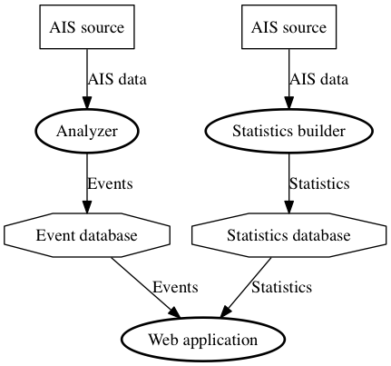

AisAbnormal
===========

# Introduction #

AisAbnormal is a system to work with maritime data received via the
[Automatic Identification System](http://en.wikipedia.org/wiki/Automatic_Identification_System), abbreviated
AIS. AIS data contain information about vessel's identities, positions, draughts, manouvering intentions, and more.
An AIS data stream therefore makes it possible to maintain a detailed picture of maritime traffic.

The purpose of AisAbnormal is to detect "abnormal" vessel behaviours in real-time, so as to aid marine traffic
controllers and others to determine which of many screen targets to focus their attention to. AisAbnormal can
also be used in off-line mode to batch analyse historic, non real-time data.

# Architecture #

AisAbnormal consists of three executable modules:

* The **statistics builder** (stat-builder) which is capable of building grid-based statistics for vessel movements
inside a of grid of cells. The input is a stream of raw AIS data from file or network, and the output is a single
binary file containing the calculated statistics.

* The **event analyzer** (analyzer) which is capable of receiving raw AIS data (from replay from file or live from
network) and analyzing these AIS data to detect abnormal vessel behaviours. Some analyses of vessel behaviour are
based on statistical data produced by the stat-builder, while others are based on vessel behaviour alone. If an analysis
gives rise to a vessel being perceived to exhibit "abnormal behaviour" than an event is recorded and stored in a database
together with information about the vessel, the event type, the involved parties, the time and location, and the statistic
used as a basis for the event.

* The **web front-end** (webapp) which is a browser based web application which makes a user capable of working with
charts (including nautical charts available via [WMS](http://en.wikipedia.org/wiki/Web_Map_Service)), vessels, grid/cells,
statistical data and detected abnormal events.

The architecture can be visualized like this:

In the diagram the "AIS sources" can be files with recorded AIS data, or network streams with live or recorded data.
The bold ellipses depict executables, which are described in further detail below.

# Prerequisites #
The only prerequisite for running the executables in AisAbnormal is a standard instance of the Java 8 runtime
environment (JRE) which can be downloaded from Oracle's website. Until March 2014 only early access versions are available.

[Download Java 8 runtime](http://www.oracle.com/technetwork/java/javase/downloads/ea-jsp-142245.html).

# Dependencies #
AisAbnormal is programmed in:

* Java 8
* Javascript

and standing on the shoulders of amongst others:

* [OpenLayers](http://openlayers.org/)
* [Jetty](http://www.eclipse.org/jetty/)
* [MapDB](http://www.mapdb.org/)
* [GNU Trove4J](http://trove.starlight-systems.com/)
* [Hibernate](http://hibernate.org/)
* [H2](http://www.h2database.com/)
* [Postgres](http://www.postgresql.org/)
* [Google Guava](https://code.google.com/p/guava-libraries/)
* [Google Guice](https://code.google.com/p/google-guice/)
* [jQuery](http://jquery.com/)
* [Twitter Bootstrap](http://getbootstrap.com/)
* [DMA eNav](https://github.com/dma-enav/e-Navigation)
* [DMA AisLib](https://github.com/dma-ais/AisLib)

unit and functional tested using

* [JUnit](http://junit.org/)
* [JMock](http://jmock.org/)
* [Selenium](http://seleniumhq.org/)
* [PhantomJS](http://phantomjs.org/)
* [GhostDriver](https://github.com/detro/ghostdriver)

and built with:

* [Maven](http://maven.apache.org/)

# Building #

    mvn clean install

[Development builds](http://dma.ci.cloudbees.com/job/AisAbnormal/) are available on [CloudBees](http://cloudbees.com/).

# Developing #

AisAbnormal is IDE agnostic and can be developed using any text editor. However, it has been
successfully built and run with both Eclipse and IntelliJ IDEA.

To use Eclipse the M2 plugin or the Maven eclipse target are recommended:

    mvn eclipse:eclipse
    
# Running #

Executable jars will be created for the command line applications.

## Statistics builder ##

### Starting ###
The stat-builder is kept in the ais-ab-stat-builder folder, and can be invoked like this:

    $ cd ais-ab-stat-builder/
    $ java -jar target/ais-ab-stat-builder-0.1-SNAPSHOT.jar

This will produce a helpful output like this:

    The following options are required: -input -output
    Usage: AbnormalStatBuilderApp [options]
      Options:
        -downsampling
           Downsampling period (in secs).
           Default: 60
        -gridsize
           Grid resolution (approx. cell size in meters).
           Default: 200
      * -input
           Glob pattern for files to read. '.zip' and '.gz' files are decompressed
           automatically.
        -inputDirectory
           Directory to scan for files to read
           Default: .
        -mt
           Run multi-threaded.
           Default: false
      * -output
           Name of output file.
        -r
           Recursive directory scan
           Default: false

The -mt option is currently experimental and may be subject to be removed.

As an example: To launch the stat-builder where it reads AIS input from a compressed plain text file
named aisdump_dk.txt.gz, downsamples these messages by 10 seconds, uses a cell size of 200 metres for the grid
system, and stores the output in a file called test-stats.statistic - use this command line:

    java -jar target/ais-ab-stat-builder-0.1-SNAPSHOT.jar -downsampling 10 -gridsize 200 -inputDirectory /data/ais -input aisdump_dk.txt.gz -output /data/stats/test-stats

### Output ###
The stat-builder produces two files: One with the extension .statistics
and one with the extension .statistics.p:

    $ ls -l statistics/
     -rw-r--r--+ 1 tbsalling  staff      131072 20 Feb 15:06 test-stats.statistics
     -rw-r--r--+ 1 tbsalling  staff     6291456 20 Feb 15:06 test-stats.statistics.p

It is important to keep these two files together and keep them together as a pair if moving or copying
them around in the file system.

## Analyzer ##

### Starting ###
The analyzer can be started like this:

    $ cd ais-ab-analyzer/
    $ java -jar target/ais-ab-analyzer-0.1-SNAPSHOT.jar

This will produce a helpful output like this:

    Usage: AbnormalAnalyzerApp [options]
      Options:
      * -aisDataSourceURL
           Uniform Resource Locator pointing to source of AIS data ('file://' and
           'tcp://' protocols supported).
        -downsampling
           Downsampling period (in secs).
           Default: 10
        -eventDataDbFile
           Name of file to hold event data.
        -eventDataDbHost
           Name of the event database RDBMS host.
        -eventDataDbName
           Database name to use for the event database with the RDBMS host.
        -eventDataDbPassword
           Password to connect to the event database RDBMS host.
        -eventDataDbPort
           Remote port of the event database RDBMS host.
        -eventDataDbUsername
           Username to connect to the event database RDBMS host.
      * -eventDataRepositoryType
           Type of repository used to hold event data ('h2', 'pgsql').
      * -statistics
           Name of file containing statistics data.

To start the analyzer reading an AIS stream from file aisdump.txt.gz, downsample these by 10 seconds,
use the previosly generated test-stats statistical data, and store the results in an H2 database named
'test-events' - use the following example command line:

    $ java -jar target/ais-ab-analyzer-0.1-SNAPSHOT.jar -aisDataSourceURL file:///data/ais/aisdump_dk.txt.gz -statistics /data/statistics/test-stats -eventDataRepositoryType h2 -eventDataDbFile /data/events/test-events

It is also possible to connect the analyzer directly to an AIS data from a TCP/IP network source in line with this:

    $ java -jar target/ais-ab-analyzer-0.1-SNAPSHOT.jar -aisDataSourceURL tcp://192.168.1.12:4001 -statistics /data/statistics/test-stats -eventDataRepositoryType h2 -eventDataDbFile /data/events/test-events

### Output ###
The Analyzer, when configured to store to an H2 database, will produce an event database file like this:

    $ ls -l /data/events/
    -rw-r--r--+  1 tbsalling  staff     53248 21 Feb 10:34 test-events.h2.db

This is a file, that contains the events and which can later be used with the webapp.

### Diagnostic output ###
A normal startup of the analyzer produces output in line with this:

    10:32:45,352 INFO  main             AbnormalAnalyzerAppModule        AbnormalAnalyzerAppModule created (dk.dma.ais.abnormal.analyzer.AbnormalAnalyzerAppModule@1f89ab83).
    10:32:45,591 INFO  main             AbnormalAnalyzerApp              java.version: 1.8.0-ea
    10:32:45,591 INFO  main             AbnormalAnalyzerApp              java.specification.version: 1.8
    10:32:45,591 INFO  main             AbnormalAnalyzerApp              java.vm.version: 25.0-b66
    10:32:45,591 INFO  main             AbnormalAnalyzerApp              java.home: /Library/Java/JavaVirtualMachines/jdk1.8.0.jdk/Contents/Home/jre
    10:32:45,591 INFO  main             AbnormalAnalyzerApp              java.vendor: Oracle Corporation
    10:32:45,592 INFO  main             AbnormalAnalyzerApp              os.arch: x86_64
    10:32:45,592 INFO  main             AbnormalAnalyzerApp              os.name: Mac OS X
    10:32:45,592 INFO  main             AbnormalAnalyzerApp              os.version: 10.9.1
    10:32:45,592 INFO  main             AbnormalAnalyzerApp              user.name: tbsalling
    10:32:45,592 INFO  main             AbnormalAnalyzerApp              AbnormalAnalyzerApp created (dk.dma.ais.abnormal.analyzer.AbnormalAnalyzerApp@4524411f).
    10:32:45,602 INFO  main             AbnormalAnalyzerAppModule        Created AisReader (Thread[Thread-1,5,main]).
    10:32:45,604 INFO  main             AppStatisticsServiceImpl         AppStatisticsServiceImpl created (dk.dma.ais.abnormal.analyzer.AppStatisticsServiceImpl@78186a70).
    10:32:45,606 WARN  main             StatisticDataRepositoryMapDB       File IndreDKtilStat-200-10.statistics already exists!
    10:32:45,674 INFO  main             AbnormalAnalyzerAppModule        Opened statistic set database with filename '../../../data/statistics/IndreDKtilStat-200-10.statistics' for read.
    10:32:45,694 INFO  main             AbnormalAnalyzerAppModule        Statistic data repository is valid.
    10:32:45,696 INFO  main             AbnormalAnalyzerAppModule        Created Grid with size 200.0 meters.
    10:32:45,697 INFO  main             TrackingServiceImpl              TrackingServiceImpl created (dk.dma.ais.abnormal.tracker.TrackingServiceImpl@351d0846).
    10:32:45,780 INFO  main             AbnormalAnalyzerAppModule        Created ReplayDownSampleFilter with down sampling period of 10 secs.
    10:32:45,780 INFO  main             PacketHandler                    PacketHandlerImpl created (dk.dma.ais.abnormal.analyzer.PacketHandlerImpl@2f7c2f4f).
    10:32:45,907 INFO  main             Version                          HCANN000001: Hibernate Commons Annotations {4.0.2.Final}
    10:32:45,911 INFO  main             Version                          HHH000412: Hibernate Core {4.2.8.Final}
    10:32:45,913 INFO  main             Environment                      HHH000206: hibernate.properties not found
    ...

While running, the analyzer will periodically emit statistical output about its state of operation:

    10:32:46,969 INFO  pool-1-thread-1  AppStatisticsServiceImpl         ==== Abnormal analyzer statistics ====
    10:32:47,098 INFO  Thread-1         TrackingServiceImpl              Now processing stream at time Tue Nov 12 12:21:41 CET 2013
    10:32:49,051 INFO  Thread-1         SuddenSpeedChangeAnalysis        Tue Nov 12 12:34:09 CET 2013: Detected SuddenSpeedChangeEvent for mmsi
    10:31:46,969 INFO  pool-1-thread-1  AppStatisticsServiceImpl         Pos message count                      0
    10:32:46,969 INFO  pool-1-thread-1  AppStatisticsServiceImpl         Stat message count                     0
    10:32:46,969 INFO  pool-1-thread-1  AppStatisticsServiceImpl         Track count                            0
    10:32:46,969 INFO  pool-1-thread-1  AppStatisticsServiceImpl         Message rate                           0 msg/sec
    10:32:46,969 INFO  pool-1-thread-1  AppStatisticsServiceImpl         ==== Application statistics ====
    10:32:46,969 INFO  pool-1-thread-1  AppStatisticsServiceImpl         ==== Abnormal analyzer statistics ====
    10:32:46,969 INFO  pool-1-thread-1  AppStatisticsServiceImpl         ==== Abnormal analyzer statistics ====
    10:32:47,098 INFO  Thread-1         TrackingServiceImpl              Now processing stream at time Tue Nov 12 12:21:41 CET 2013
    10:32:49,051 INFO  Thread-1         SuddenSpeedChangeAnalysis        Tue Nov 12 12:34:09 CET 2013: Detected SuddenSpeedChangeEvent for mmsi
    10:32:46,968 INFO  main             AppStatisticsServiceImpl         Statistics service started.
    10:32:46,968 INFO  pool-1-thread-1  AppStatisticsServiceImpl         ==== AIS Abnormal Behavior application statistics ====
    10:32:46,968 INFO  pool-1-thread-1  AppStatisticsServiceImpl         ==== Application statistics ====
    10:32:46,968 INFO  pool-1-thread-1  AppStatisticsServiceImpl         Unfiltered packet count                0
    10:32:46,968 INFO  pool-1-thread-1  AppStatisticsServiceImpl         Filtered packet count                  0
    10:32:46,968 INFO  pool-1-thread-1  AppStatisticsServiceImpl         Message count                          0
    10:32:46,969 INFO  pool-1-thread-1  AppStatisticsServiceImpl         Messages out of sequence               0
    10:32:46,969 INFO  pool-1-thread-1  AppStatisticsServiceImpl         Pos message count                      0
    10:32:46,969 INFO  pool-1-thread-1  AppStatisticsServiceImpl         Stat message count                     0
    10:32:46,969 INFO  pool-1-thread-1  AppStatisticsServiceImpl         Track count                            0
    10:32:46,969 INFO  pool-1-thread-1  AppStatisticsServiceImpl         Message rate                           0 msg/sec
    10:32:46,969 INFO  pool-1-thread-1  AppStatisticsServiceImpl         ==== Application statistics ====

And also, periodically it will output lines like this:

    10:32:47,098 INFO  Thread-1         TrackingServiceImpl              Now processing stream at time Tue Nov 12 12:21:41 CET 2013

Which tells the timestamp of the last processed AIS message. This is particularly useful when working with AIS datasets
from files, as it helps to estimate the time of completion.

### Choice of database system ###
Using an H2 database has the advantage, that no separate RDBMS system need to be running. The software
for the H2 database is embedded into the analyzer, so it can readily store in H2 format to a single file.
The disadvantage is, that only one process at a time can access the H2 event database file. This prohibits
running the analyzer and the webapp at the same time.

To run the analyzer and the webapp simultaneously requires a more advanced RDBMS than H2, and for this
purpose the analyzer can connect to and use a separately installed, configured, and running Postgres
database accessible via the designated IP, port, database name, user name and password.

## Web application ##

### Starting ###

The web application contains an embedded web server, and it does therefore not need to be deployed in a traditional
Java middleware server. Instead, the web application can be started like this:

    $ cd ais-ab-web/
    $ java -jar target/ais-ab-web-0.1-SNAPSHOT.jar

This will produce a helpful output like this:

    The following options are required: -statistics -eventDataRepositoryType
    Usage: ais-ab-web [options]
      Options:
        -eventDataDbFile
           Name of RDBMS file to hold event data.
        -eventDataDbHost
           Name of the event database RDBMS host.
        -eventDataDbName
           Database name to use for the event database with the RDBMS host.
        -eventDataDbPassword
           Password to connect to the event database RDBMS host.
        -eventDataDbPort
           Remote port of the event database RDBMS host.
        -eventDataDbUsername
           Username to connect to the event database RDBMS host.
      * -eventDataRepositoryType
           Type of repository used to hold event data ('h2', 'pgsql').
      * -statistics
           Filename of statistic data file to read.
        -port
           Port no. for listening to HTTP.
           Default: 8080

To launch the web application where it reads statistical data from the test-stats files, reads events from the
test-events H2 file - and exposes the web application on port 8080, issue the following example command line:

         java -jar target/ais-ab-web-0.1-SNAPSHOT.jar -statistics data/statistics/test-stats -eventDataRepositoryType h2 -eventDataDbFile data/events/test-events -port 8080

Once the web application has launched it can be accessed from a browser, e.g. locally, using this URL:

         http://localhost:8080/abnormal/

Once the web application server part is launched and a browser pointed to it, the expected initial browser screen
looks like this:

_Note! Until further, it is necessary to launch the application with the current directory being ais-ab-web (so that
static assets assumed by the program to be in src/main/webapp are available)._

# Modules ##

##ais-ab-common##

This module contains all common resources for the project. Examples are the Tracker and the Application Statistics which
are used by both the stat-builder and the analyzer.

##ais-ab-stat-builder##

Command line application building/updating a statistics database using historical AIS data from a file. See detailed
description above.

##ais-ab-stat-db##

This module hols the interface and implementations of a statistics database API. This is used by both the stat-builder,
the analyzer, and the web application.

Currently the only provided implementation of the statistics database is based on the MapDB storage engine.

##ais-ab-analyzer##

This module holds a command line tool to analyze AIS data for abnormal events. See detailed description above.

##ais-ab-event-db##

Interface and implementation of an event database API, which is used by both the analyzer and the web application.

Currently two implementations of the event-db interface are provided:

- H2
- Postgres

##ais-ab-web##
This module holds the web application for presenting statistical data and abnormal events. See detailed description
above.
